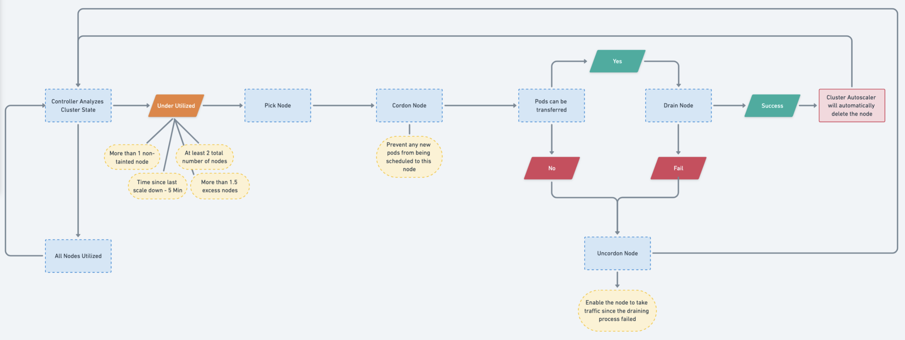

# **Node Refiner Operator**
<!-- TOC -->
[**Node Refiner Operator**](#node-refiner-operator)
- [**Node Refiner Operator**](#node-refiner-operator)
  - [Description](#description)
  - [Pitfall](#pitfall)
  - [Proposed Solution](#proposed-solution)
    - [Node Refiner Process](#node-refiner-process)
    - [NR Conditions](#nr-conditions)
  - [Summary](#summary)
    - [Process Summary](#process-summary)
  - [Important Links](#important-links)
  - [Flowchart](#flowchart)
- [@SAP/repository-template](#saprepository-template)
- [Containing files](#containing-files)
<!-- /TOC -->

## Description
In long-running clusters (production clusters) we often can improve the efficiency of resource usage by rescheduling workloads from under-utilized nodes.

This job can be partly performed by the cluster autoscaler (**CA**) if we look at each node separately - this can be done by setting a utilization metric that the **CA** respects, as long as the node achieves utilization metric above that threshold the node stays, otherwise the **CA** will attempt to remove this node from the cluster.

The above mentioned solution might sound like it solves the problem of under-utilized nodes, but lets take another scenario as an example.

## Pitfall
Lets assume that the utilization metric is set to 50%, that means if either the usage of RAM or CPU resources of the node is above 50% - the node stays.

In this figure we can see that even though the utilization target of over 50% is achieved, there is wasted resources that can be terminated without affecting the delivery of our tasks.

## Proposed Solution

We introduce the notion of excess nodes. By calculating the excess resources from each node in the cluster and combine them together, we get a holistic view on how many resources can potentially be saved.

### Node Refiner Process
1. Node Refiner (**NR**) determines the node with the largest potential to be terminated (the one with the least utilization metrics) and elects it as a potential node to drain.
2. **NR** cordons the node to avoid new pods being scheduled on this node while the operator is evicting the existing pods on this node.
3. Pods are being gracefully terminated in parallel. In case any of the pods have conditions that do not allow eviction the draining process halts and the node is uncordoned.
4. If all the Pods are succesfully evicted, **NR** will then leave the node cordoned; the cluster autoscaler should consequently pick that this node as it is under-utilized and needs to be deleted.
5. As long as there are excess nodes above a certain configurable threshold the process is repeated.

### NR Conditions
Each cluster might need its own set of conditions to run NH efficiently. The following configurations allow to adjust the behavior of NH to be more relaxed (deliver jobs in a large amount of nodes) or aggressive (deliver jobs in the least amount of nodes) depending on the clusters needs.

| Configuration | Description | Default Value |
|:----:|-----------|-----------|
|**CalculationLoopFrequency**|Time to recalculate the cluster utilization metrics| 1m |
|**DefaultMinimumTimeSinceLastAddition**|Grace period after a node is added to the cluster to ensure that no draining of nodes takes place before the cluster stabilizes its resources|60m|
|**DefaultTimeGap**|Default time between node drains, or if a node fails to drain it's the time before another retry takes place|10m|
|**DefaultMinimumNodes**|The minimum number of nodes that should be in the cluster|2|
|**DefaultMinimumNonTaintedNodes**|The minimum number of non-tainted nodes that should be in the cluster|2|
|**DefaultExcessNodes**|If the number of excess nodes in the cluster exceeds this number a scale down takes place.|2|
|**DrainerEnabled**|Flag for enabling the drainer to take any actions. Set to False for "dry run" mode|True|

## Summary
**Node Refiner (NR)** aims to collect information about the cluster by aggregating all the nodes and pods metrics to build an overview of the cluster utilization. By analyzing this information, we can make an informed decision on whether we should remove some of the existing nodes or not. 

Also, it allows us to pick the node with lowest utilization metrics, making sure that we remove the node that will cause the smallest disturbance in the availability of our cluster. **NR** calculates the metrics. When a removal process is about to occur, **NR** drains the node gracefully and outsources the deletion process of the node to the **Cluster Autoscaler**; we took that decision for two reasons.

1.  To not rewrite redundant code since the **cluster autoscaler** already has that functionality fulfilled.
2.  **CA** notifies a lot of subscribers to the event of a removal of node (ex. Gardener), thus making sure that we do not fall in a limbo of removing/adding node; therefore, we found that it's the most stable when the **CA** handles that part of the process.

### Process Summary
1. Gather information about the existing pods in the cluster and analyze their requests/usage
2. Analyze the cluster capacity and whether it can satisfy the pods requirements with less nodes
3. Analyze the individual nodes and check whether any of them can be evicted.
4. Drain under-utilized node gracefully
 
## Important Links
1. [Go Node Documentation](https://pkg.go.dev/k8s.io/api/core/v1#Node)
2. [Building Operators using Kubebuilder](https://book.kubebuilder.io/)
3. [Flow Chart](https://whimsical.com/workload-controller-UhkRphzpwvjFFu1tt9YQwm)
4. [Writing Controllers Docs](https://github.com/kubernetes/community/blob/master/contributors/devel/sig-api-machinery/controllers.md)
  
  ## Flowchart

For testing refer to this [doc](docs/testing.md)

# @SAP/repository-template
Default templates of SAP's repositories. Provides template files including LICENSE, .reuse/dep5, Code of Conduct, etc... All repositories on github.com/SAP will be created based on this template.

# Containing files

1. The LICENSE file:
In the most cases, the license of SAP's projects is `Apache 2.0`.

2. The .reuse/dep5 file: 
The [Reuse Tool](https://reuse.software/) must be used for your open source project. You can find the .reuse/dep5 in the project initial. Please replace the parts inside the single angle quotation marks < > by the specific information for your repository.

3. The README.md file (This file):
Please edit this file as it is the primary description file for your project.